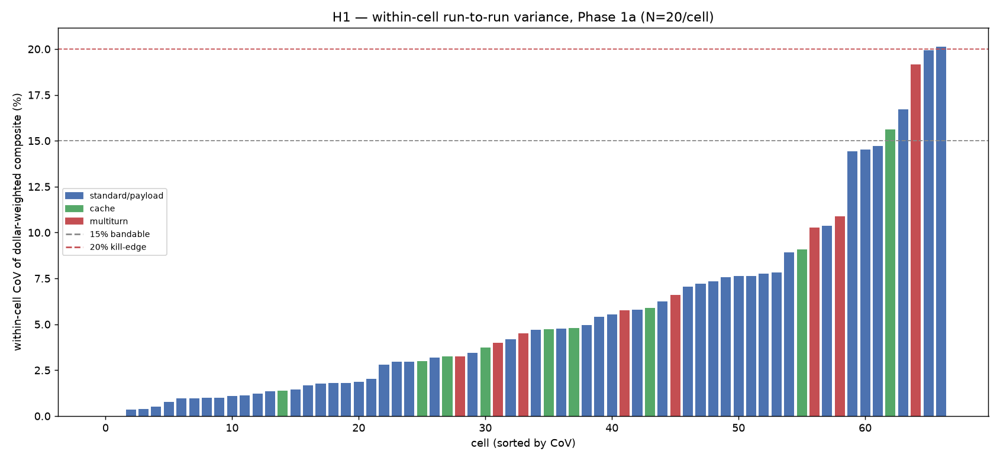
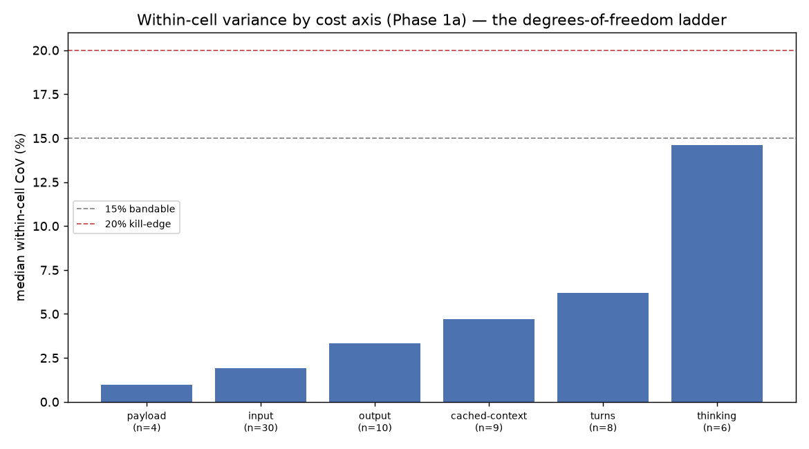
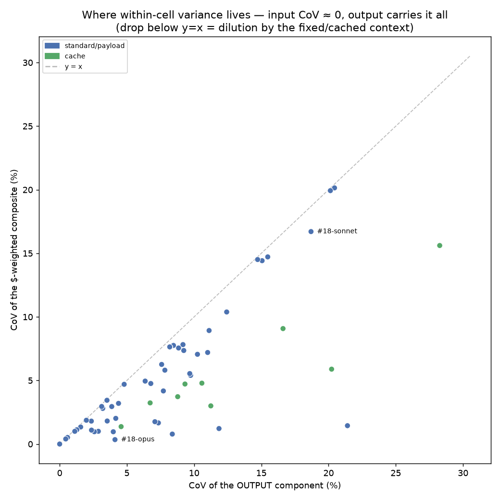
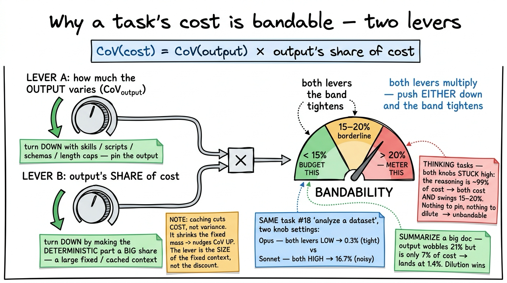

# Can you put a budget on a token? — Phase 1a results

*Managing Intelligence · Experiment 1 · run `run-20260624T112122Z-cfa60e` · 2026-06-25*

> **The question.** Enterprises want to budget for AI the way they budget for anything else — a
> number per unit of work. But the folk wisdom is "you can't, token cost is unpredictable." Is that
> true? We ran a controlled experiment to find out, for the everyday tasks knowledge work is made
> of. This is one piece of a larger question — *how do you manage intelligence without breaking the
> bank?* — and it's the piece that asks whether a per-task budget is even a coherent idea.

---

## TL;DR

- We measured **67 task-cells** — everyday knowledge-work tasks (`task × load size × model ×
  config`), each run **20 times identically** — to ask one thing: *is a task's token cost stable
  enough, run-to-run, to express as a band?*
- **Scope first, so nothing is oversold:** this run covers **discrete, low-fan-out tasks.** The
  agentic, high-fan-out work where cost is hardest to predict was **deliberately excluded** — it's
  Phase 1b, still to come. We did **not** prove "AI cost is budgetable"; we tested the everyday half.
- **For 62 of 67 cells, the answer is yes.** Within-cell variability (coefficient of variation) came
  in under **15%**, median **4.5%**. Drafting, classifying, translating, summarizing, extracting —
  the workhorse tasks — are **budgetable**.
- **No model is systematically noisier.** On a fixed input, the median run-to-run "die roll" is
  single-digit-percent — flat across Haiku, Sonnet, and Opus. There's no "slot-machine model" to
  blame. (Model and task do *interact*, though — see §3.2.)
- **The variability that exists is structured.** It tracks primarily **how much latitude the model
  has over its output**: pinned-output tasks are ~0%; open-ended reasoning was the only regime to
  touch the ~20% "can't band it" edge. Note this driver was **not** what we pre-registered (we
  predicted *fan-out*) — we flag it as an unplanned finding, not a confirmed prediction (§3.3).
- **We proved where the variance lives.** With the input frozen, **100% of run-to-run cost variance
  is in the output component.** That yields a clean rule:
  **`cost variability = how much the output varies × the output's share of cost`.**
- **Two levers follow** (both architectural): *constrain the output* (skills / scripts / schemas —
  the lever we still need to prove causally) **or** *make the output a small share of cost* (a large
  fixed context). Open-ended reasoning resists both, which is why it's the hard case.

---

## 1. What was run

The unit of measurement is a **cell**: one task, at one load size, on one model, under one fixed
config. Each cell was run **N = 20** times — identical input every time — so the only thing that
moves within a cell is the model's own stochasticity.

| | |
|---|---|
| **Cells** | 67 (`task × band × model × config`) |
| **Repetitions** | N = 20, flat, pre-committed, uniform (no peeking-and-extending) |
| **Records** | 2,069 captured · **0 quarantined** |
| **Tasks** | 18 everyday tasks: draft / rewrite / classify / translate / summarize / extract / Q&A / long-form / cached-KB / multi-turn debug / iterative refine / analyze dataset / strategy brief / … |
| **Models** | Haiku 4.5 (`claude-haiku-4-5-20251001`), Sonnet 4.6 (`claude-sonnet-4-6`), Opus 4.8 (`claude-opus-4-8`) |
| **Load** | Token volume ≈ **14.05M** (input 7.71M · output 4.23M · cache-read 2.00M · cache-write 0.10M; thinking 0.79M is *within* output) |
| **Wall-clock** | ≈ 17.2 h (2026-06-24 → 25) |
| **Provenance** | Every record carries the exact config hash, fixture hash, and model/tokenizer version — each run replays from its record alone. |

*A **record** is one API call; a **run** is one execution of a cell — the two differ by cell type.
Single-shot cells = 1 call/run (50 cells × 20 = 1,000 records); cache cells add a one-time warm-write
(9 × [1 write + 20 reads] = 189); multi-turn cells log every turn (8 cells × 20 sessions × 3–8 turns
= 880). Every one of the 67 cells is still **N = 20 runs** — 1,000 + 189 + 880 = 2,069.*

**Why 67 cells from 18 tasks?** Each task fans out across the things we wanted to compare — load
size (small/medium), and the **model ladder**. The ladder is deliberate: every task is run on the
model we'd actually use *and* on Opus, so the gap between them measures **over-service** (the cost of
using a bigger model than the task needs). That over-service comparison is a *different* axis from
the question this report answers, and we keep the two strictly separate.

**What's not here (on purpose):** the high-fan-out **agentic** tasks — multi-source research,
competitive analysis, multi-file refactor, codebase audit. Those are **Phase 1b**, deliberately
deferred. They are exactly where we predicted, in advance, that cost is *hardest* to band — so their
absence is the single most important caveat on everything below. See §5.

## 2. How it was run

The whole experiment rests on one discipline: **measure, don't estimate.** The API returns exact
token counts on every call — that *is* the data. We never substitute a guessed number for one a call
would return.

- **Full usage vector, every call.** Input, output, cache-read, cache-write, tool-result, and
  thinking tokens are captured *separately* (they aren't fungible — a cache-read token costs ~1/10 a
  fresh-input token), alongside latency and wall-clock. Raw usage is stored verbatim; a typed
  projection is validated against it.
- **One thing moves at a time.** *Within* a cell, everything is frozen — the artifact, the exact
  prompt, the model+tokenizer, the effort level, the temperature — so only model stochasticity
  varies. *Across* cells, we change exactly one axis (load size **or** model **or** thinking on/off).
  Temperature is omitted on every call (provider default), so it can't leak in as a hidden variable.
- **Frozen fixtures.** 21 task artifacts were frozen and hashed in advance. Nothing is improvised or
  regenerated mid-run; a fixture is pinned by hash so the same input is provably reused.
- **Family-specific honesty.** Cache tasks use *warm-once-read-many* and report the one-time write
  cost separately from the read distribution (mixing them would be meaningless). Multi-turn tasks
  capture **per-turn** usage, not just the session total. Cache hits are asserted on every read.
- **Tokens now, dollars later.** Records store raw token counts only. Price is a single scalar
  applied at *analysis* time — so the dataset never bakes in a price that will change next week.
- **Pre-registered.** The hypothesis and its kill-condition were written down *before* any data
  existed. Results are recorded as pointers to the data, never retrofitted to it.

> **One honest operational note.** The first attempt aborted ~25% in — not on money, but on a
> monthly API *usage limit* (a separate ceiling from the credit balance). We raised the cap and
> re-ran the whole thing from scratch rather than stitch two partial runs together. The clean run is
> the one reported here.

## 3. Key findings

### 3.1 The headline: most everyday tasks are bandable

For each cell we computed the **coefficient of variation (CoV)** of its cost across the 20 runs — the
standard deviation as a percentage of the mean. Low CoV = a tight, budgetable band. The pre-registered
threshold: **under ~15% → bandable; persistently over ~20% → you can only monitor the distribution,
not predict it.**

**62 of 67 cells came in tight (CoV < 15%). Median 4.5%, max 20.1%.** The five that didn't are not
random — every one is a high-**latitude** task (open-ended reasoning, multi-turn iteration, or a
large analytical payload). Notably, all five are **low-fan-out** — which is *not* where our
pre-registration expected the noise to be (we predicted fan-out; see §3.3):

| Cell | Family | CoV |
|---|---|---|
| strategy brief, thinking-on, Sonnet (`15-high`) | thinking | **20.1%** — the one cell over the edge |
| strategy brief, thinking-on, Sonnet (`15-max`) | thinking | 19.9% |
| iterative refine, Opus (`17-few`) | multi-turn | 19.2% |
| analyze dataset, Sonnet (`18-M`) | payload | 16.7% |
| code edit, Haiku (`11-M`) | cache | 15.6% |

The floor is genuinely flat: classification = **0.0%**, translation ≈ **0.5%**.



*Each bar is one cell's run-to-run variability. The vast majority sit far below the 15% "bandable"
line; only the thinking/iteration/payload tasks approach the 20% edge.*

### 3.2 No model is systematically noisier — but model and task interact

Grouped by model, the **median variability is flat**: Haiku 4.8% · Opus 4.6% · Sonnet 3.9%. No model
is a *systematic* source of noise — there's no "noisy model" you can blame across the board.

But that is a statement about **main effects, not interactions.** On a *given* task, model choice can
move variability a lot: analyze-dataset runs at **0.3% on Opus and 16.7% on Sonnet** — same frozen
input, ~50× apart — because the two models make different choices about *how much* output to produce.
So the honest budgeting read is narrower than "the model doesn't matter": no model is noisy
wholesale, but **you still have to measure the specific model-on-task cell.** A cheaper model isn't
automatically *less* predictable — and isn't automatically *more* so either; it depends on the pair.

### 3.3 Variance tracks the model's degrees of freedom

Group the cells by their **cost axis** and a clean ladder appears — monotonic in how much latitude
the model has:



| Cost axis | median CoV |
|---|---|
| payload | 1.0% |
| input (prose to read) | 1.9% |
| output (text to write) | 3.3% |
| cached-context | 4.7% |
| turns (multi-turn) | 6.2% |
| **thinking (reasoning depth)** | **14.6%** |

Open-ended **thinking** is the only axis whose median lands in the danger zone — ~8× the bounded
tasks. The more freedom the model has over how much to produce, the wider the band. (Multi-turn sits
mid-ladder for a related reason: each turn's output is fed back as the next turn's input, so latitude
**compounds** across turns — a variance amplifier by construction.)

> **What we predicted vs. what we found — stated plainly.** Our pre-registration (charter §3) predicted
> variance would track **fan-out**: low-fan-out tasks tight, high-fan-out tasks noisy, and it said
> *"surprised if a discrete cell is noisy."* Two things follow honestly. **(1)** The fan-out half is
> **untested** — every high-fan-out task is deferred to Phase 1b (§5). **(2)** Among the low-fan-out
> tasks we *did* measure, the noisy ones (thinking, iteration, large payload) are **not** explained by
> fan-out — they track **output latitude**, a driver §3 did **not** name. So we are reporting output
> latitude as an **unplanned, post-hoc finding** — flagged, not folded into the pre-registration. It
> is neither a confirmation of §3 (whose mechanism is untested) nor a clean refutation (the noisy
> cells are borderline 15–20%). Calling this "consistent with what we predicted" would be a retrofit.

### 3.4 Where the variance actually lives (the proof)

Because the input artifact is frozen, the tokenizer turns it into the **exact same tokens on every
run** — so the input's *cost* is identical and its variability is **exactly 0%** on every cell. So
**100% of a cell's run-to-run cost variance comes from the output.** That collapses the whole metric
to one identity:

> ### cost variability = (output variability) × (output's share of cost)

It explains every case — including the bandable ones — with a single mechanism:

| How a task stays bandable | example | output varies | output's cost share | result |
|---|---|---|---|---|
| **Output is pinned** | translate | ~1% | 88% | **~1%** |
| **Output is diluted** (tiny cost share) | summarize a big doc | 21% | **7%** | **1.4%** |
| **Neither → unbandable** | open-ended strategy (thinking) | 15–20% | **91–99%** | **15–20%** |



*Every cell sits on or below the diagonal. A cell far below it (like a large-document summary) has
wildly variable output that barely matters because the output is a sliver of the cost. A cell on the
diagonal (open-ended reasoning) has output that is nearly all the cost — so its variability passes
straight through.* The same-task split is the showcase: **`#18-opus` wrote short, consistent output
(8% of cost → 0.3% variability); `#18-sonnet` wrote long, variable output (89% of cost → 16.7%).**

### 3.5 The takeaway, in one picture: two levers

The identity `variability = output-variability × output-cost-share` points to **two levers** to make
a task bandable — both **architectural choices**, not model choices. They differ in how *settled*
they are, so we mark each:



- **Lever A — pin the output** *(hypothesized — see §5; now **under test** in Phase 1c).* Constrain
  *what* and *how much* the model generates: skills, scripts, schemas, length caps → lower output
  variability. This is the lever we had **not yet proven causally**: the decomposition shows
  pinned-output tasks *are* tight across task types, but we hadn't taken one task and *tightened it
  on purpose*. That is exactly what the §6 A/B tests — now **pre-registered as charter v0.6 H5/H6 and
  built as the Experiment 1c determinism A/B** (`runs/phase1c.yaml`, `fixtures/skills/`): skill {off,on}
  × model {Haiku,Sonnet,Opus} on tasks #4/#6/#9, with a frozen quality judge. Result pending the run.
- **Lever B — make the deterministic cost a large share** *(this one is just algebra).* If the output
  is a small slice of the bill, its variability is diluted — and because the input/context cost is
  deterministic (the same every run), a **large fixed context** mechanically drops the multiplier.
  This isn't a correlation; it falls straight out of the identity.

> **One precision, because it's easy to get backwards:** *caching* is a **cost** lever, not directly
> a variance lever. Caching makes the input *cheaper*, which actually *raises* the output's cost
> share — nudging dollar-variability slightly **up**, not down. Cached tasks band tightly because the
> cached context is **large** (a big deterministic mass), not because it's cached; the same context
> *un*cached would be even tighter, just pricier. The variance lever is the *size* of the fixed cost,
> not the discount on it.

Push **either** lever down and the band tightens. Tasks like open-ended strategy resist both — the
reasoning *is* the product and *is* the cost — which is why they're the hard case.

## 4. What this means for managing intelligence

- **Per-task budgeting is a coherent idea — for most tasks.** The model-stochasticity floor is
  small, and the variability that remains is *predictable from the task's shape*. You can label a
  task **"budget this"** vs **"meter this"** before you run it, from its structure.
- **The right artifact is an instrument, not a price sheet.** Bands are model-and-tokenizer-specific
  (Opus tokenizes the same text ~35% heavier than Haiku/Sonnet) and shift every model generation.
  The durable thing isn't the numbers — it's the *machine that re-measures them*.
- **Determinism is a cost-control lever, not just a quality lever.** Lever A (skills/scripting) and
  Lever B (a large fixed/cached context) are how you move a task from "meter it" to "budget it" —
  with the caveat above that caching's *primary* effect is cost, not variance. That reframes
  "specialized skills" from a quality story into a *predictability-and-cost* story.

## 5. Honest limits

This is deliberately the front half of the result. To not overclaim:

- **The hard half is untested — and our prediction was about exactly that half.** We pre-registered
  that variance tracks **fan-out**, with the high-fan-out **agentic** tasks (research, competitive
  analysis, multi-file refactor, codebase audit) most likely to be unbandable. Those tasks were
  **not in this run** (Phase 1b), so the fan-out prediction is **untested** and the "can't band it"
  kill-condition **cannot have fired**. And the noise we *did* find — in low-fan-out tasks — tracks
  **output latitude**, a driver §3 didn't name (logged as an unplanned finding, §3.3), so a tight
  Phase 1a is *not* a clean confirmation of what we predicted.
- **It's a correlation, not yet a cause.** "Variance tracks latitude" is observed *across* task
  types; we have not yet taken one task and *manipulated* its determinism to prove the link is
  causal. (That's the A/B in §6.)
- **One snapshot.** A single run, N = 20, June-2026 models and prices. The numbers are a
  point-in-time prior, not a permanent constant.

We are **not** claiming "AI cost is predictable." We're claiming something narrower and more useful:
*for discrete tasks, it is — and here's a rule for telling which tasks those are.*

## 6. Next steps

Two follow-ons, in priority order:

1. **Phase 1b — measure the agentic regime.** Run the deferred high-fan-out tasks the same
   disciplined way. This is what completes the test (it's the only thing that can fire — or clear —
   the kill-condition) and answers the obvious critique that this run only covered easy tasks. It
   requires a tool-use-loop module and frozen agentic corpora. It's pre-registered already, so it's
   the clean next step — and the infrastructure and baseline it produces feed directly into (2).
2. **The determinism A/B — prove the two-lever model causally.** Take a fixed task and run it two
   ways — *prompted* vs *skill-scripted* — holding the model constant, and measure all three things
   that matter: does the band tighten (output variability), does it get cheaper (tokens), and does a
   cheaper model now match a premium one on quality (cross-model equivalence)? A *light* version
   (one bounded task) is a fast signal; a *heavy* version (agentic) is best layered on Phase 1b so it
   reuses that baseline. It needs its own pre-registered hypothesis and a frozen quality judge.

*(Cost/sequencing planning for both is tracked separately, internally.)*

---

## Reproduce it

```bash
# Headline H1 result (per-cell variability + the per-component decomposition)
uv run python -m analysis.h1 results/run-20260624T112122Z-cfa60e --prices prices/prices-2026-06.yaml
# The three correlation cuts (by model, by axis, input/output decomposition)
uv run python -m analysis.correlations
```

Full per-cell numbers: [`analysis/output/h1_cov.csv`](../analysis/output/h1_cov.csv) ·
decomposition: [`analysis/output/decomposition.csv`](../analysis/output/decomposition.csv) ·
methodology and pre-registration: [`docs/charter.md`](charter.md), [`CLAUDE.md`](../CLAUDE.md).
